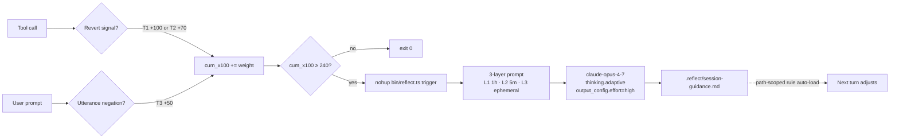

<div align="center">

# reflect

### *A session-local metacognition harness for long-running Claude Code work.*

**When your suggestions get reverted 3+ times within 10 tool calls, Opus 4.7 reads back recent tool calls + active rules + rolled-back diff, reasons about *why*, and injects guidance into the next turn.**

[](https://opensource.org/licenses/MIT)
[](https://claude.com/claude-code)
[](https://www.anthropic.com/claude/opus)
[](https://cerebralvalley.ai/e/built-with-4-7-hackathon)

</div>

---

## What is reflect?

You let Claude Code run for hours in auto mode. It does great work — and somewhere around hour two, it starts repeating the same misjudgment. You revert. It tries again. You revert.

reflect catches that cluster. When ≥3 revert signals appear within 10 tool calls (weighted threshold: 3 hard reverts = 3.0, or 2 hard + 1 utterance = 2.5, crosses the 2.4 cutoff), reflect hands recent history to Opus 4.7 and gets back one structured reflection — `pattern`, `signal`, `adjustment`, `confidence` — written to `.reflect/session-guidance.md`. Your next turn reads it via path-scoped rule injection and adjusts.

Session-local. No persistence. No team sync. No telemetry. The file is deleted at session end.

---

## How it works

Two hooks watch for three tiers of revert signal. `PostToolUse` catches Tier 1 (`git revert`, `git restore`, `git checkout HEAD --` — weight 1.0) and Tier 2 (`rm`/`unlink` of a user file, build-artifact paths excluded — weight 0.7). `UserPromptSubmit` catches Tier 3 (utterance negation like "no wait", "undo that" — weight 0.5). Weights accumulate as `cum_x100` (integer × 100, so shell arithmetic needs no `bc`). When cumulative weight crosses 240, a single-shot Opus 4.7 call fires; the hook exits in ≤50 ms while the API call runs in the background via `nohup`.



Cold call ≈ $0.05 · warm call ≈ $0.01 (95% L1 cache hit observed D2) · latency 5–6 s, non-blocking. Detailed architecture: [`ARCHITECTURE.md`](ARCHITECTURE.md). Protocol spec: [`REFLECT.md`](REFLECT.md). Cost math: [`docs/api-cost-economics.md`](docs/api-cost-economics.md).

---

## Install

```bash
npm install @chanjoongx/reflect
npx reflect init      # prints the 4 manual setup steps (auto-wire is v1.1)
```

> Published under the scoped name `@chanjoongx/reflect` (current version `0.1.0`). The binary stays `reflect` (so `npx reflect ...` works unchanged). The unscoped `reflect` name is taken by a pre-existing JavaScript parser; scoping keeps the CLI identity clear and avoids name collision. v1 is hackathon-week build — expect rough edges. Path-scope delivery gap (root-level files) is a known limitation — see `<details>` "Honest gotchas" below; v0.2 fix planned.

The v1 `init` prints copy-paste instructions; you manually:

1. Copy `node_modules/@chanjoongx/reflect/.env.example` → `.env` and set `ANTHROPIC_API_KEY=sk-ant-...`
2. Copy `node_modules/@chanjoongx/reflect/.claude/settings.example.json` → `.claude/settings.json` (or merge the `hooks.PostToolUse` + `hooks.UserPromptSubmit` blocks into your existing `settings.json`)
3. Copy `node_modules/@chanjoongx/reflect/.claude/rules/reflect-rules.md` → `.claude/rules/reflect-rules.md` (path-scoped: `src/**`, `lib/**`, `app/**`, `packages/**` — v0.2 widens to include root-level files like README/CHANGELOG)
4. Add `.reflect/` to your `.gitignore`

**Restart Claude Code** so it picks up the new hook and rule files.

```bash
npx reflect status      # verify hooks wired, API key present, last trigger
```

First reflection fires automatically once cumulative revert weight crosses the threshold. Manual trigger:

```
/brain-reflect
```

Disable per-session: `export REFLECT_DISABLED=1` (or in `.env`). Full walkthrough: [`docs/getting-started.md`](docs/getting-started.md). Common issues: [`docs/troubleshooting.md`](docs/troubleshooting.md).

---

## Viewer (optional local dashboard)

The repo also ships a localhost-only Next.js 16 dashboard at `/web/` that reads your `.reflect/` directory and renders session state, reflection history, and cross-session drift clusters. **It never deploys, never makes API calls, binds to `127.0.0.1`, and runs every file read through a PII redactor.**

```bash
npm run viewer        # build + serve production (recommended — low RAM)
# or
npm run viewer:dev    # Turbopack dev server with HMR (higher RAM on Windows)
```

Open [http://127.0.0.1:3000](http://127.0.0.1:3000). 5 routes: `/` dashboard, `/reflections`, `/patterns`, `/install`, `/roadmap`. If `.reflect/` is empty, synthetic fixtures in `web/fixtures/` drive the UI so every route renders on a fresh clone. Full notes in [`web/README.md`](web/README.md).

---

## Demo

3-minute walkthrough of reflect catching real drift in a real refactor session — recorded during the hackathon, no synthetic data.

*Video link will be posted here in a follow-up release after the hackathon-week recording completes (deadline Sun 2026-04-26). For the submission itself, the video ships via the hackathon submission form.*

The recording shows: a multi-turn refactor session, clustered reverts, the trigger firing, Opus 4.7's reflection panel, and the next turn visibly adjusting. Cost, cache hit rate, and reflection-useful-rate overlaid as text.

---

<details>
<summary><b>Honest gotchas</b></summary>

reflect is **not** a fix-all. Documented failure modes:

- **Cold-start sessions** — first ~5 turns lack causal context. reflect declines to fire (two-layer safety net: hook threshold + prompt-level refuse).
- **False trigger on intent changes** — if you change your mind mid-task, the reverts may be your shift, not assistant misbehavior. reflect flags `false_trigger_likelihood: high` and the next turn treats guidance as a question, not instruction.
- **Regulatory / domain-opaque code** — tax / KYC / GDPR may produce vague reflections. Mitigation in v1.1 (user-supplied domain rule injection).
- **Cost on large prompts** — cold call ≈ $0.05 (4,741-token L1 cached 1 h). Subsequent warm calls ≈ $0.01. See [`docs/api-cost-economics.md`](docs/api-cost-economics.md).

Full mechanism detail: [`docs/measurements.md`](docs/measurements.md#failure-modes).

</details>

<details>
<summary><b>Composition with stetkeep</b></summary>

reflect uses [`stetkeep`](https://github.com/chanjoongx/stetkeep) (CJ's existing MIT npm package) as a base dependency. Two distinct layers:

- **stetkeep** — *prevention*. Static 16-entry false-positive catalog + PreToolUse safety net. Blocks bad edits before they happen.
- **reflect** — *post-hoc reasoning*. Dynamic metacognition after revert clustering. Catches what static rules can't.

You can run either independently. Together they're a "prevention + reflection" stack. stetkeep contents are NOT part of this hackathon submission — they're prior work, installed as an npm dependency.

</details>

<details>
<summary><b>Why Opus 4.7 specifically</b></summary>

> "4.7 to me is a giant step up in capability. However, if you use it the same way that you used 4.6, you won't feel that step up. It's just amazing at long-running work." — Boris Cherny, *Built with Opus 4.7* kickoff

The reflection task is **causal reasoning over context**, not pattern classification:

- "What was I trying to do across the last 12 tool calls?"
- "Why did the user push back?"
- "What pattern in my actions led to failure?"

Smaller models flatten this — they emit generic advice ("be more careful"). Opus 4.7 holds the causal chain across 20+ tool calls + 2–3 rule documents and produces a reflection that reads like a thoughtful teammate post-mortem. Ablation results: [`experiments/`](experiments/).

</details>

<details>
<summary><b>Roadmap</b></summary>

- **v1** (this hackathon) — single-shot Opus 4.7, session-local, honest failure modes
- **v1.1** — opt-in *deep-reflect mode* (multi-turn dialogue), domain rule injection
- **v2** — optional persistence (only if v1 signals warrant — see [`REFLECT.md`](REFLECT.md) `<roadmap>`)

</details>

<details>
<summary><b>Contributing</b></summary>

We particularly want:

- New revert-signal detection patterns (with reproducer)
- Failure-mode reports (sessions where reflect fired but produced bad guidance)
- Reflection prompt improvements (with ablation evidence)
- Language ports — the harness is model-agnostic; Python / Rust ports welcome

See [`CONTRIBUTING.md`](CONTRIBUTING.md). Process: open an issue → align scope → PR.

</details>

<details>
<summary><b>Security &amp; supply chain</b></summary>

- Zero runtime dependencies on the harness layer (TypeScript + Anthropic SDK only)
- No network calls outside the single Opus 4.7 API call
- No telemetry, no analytics, no data exfiltration
- Pre-commit PII scanner (cloned from stetkeep)
- Privacy policy: [`PRIVACY.md`](PRIVACY.md) · Vulnerability reports: [`SECURITY.md`](SECURITY.md)

</details>

---

## License

[MIT](LICENSE).

---

<div align="center">

**Built by [Chanjoong Kim](https://github.com/chanjoongx) · Hackathon week of 2026-04-21**
*A harness for the model 6 months from now.*

</div>
